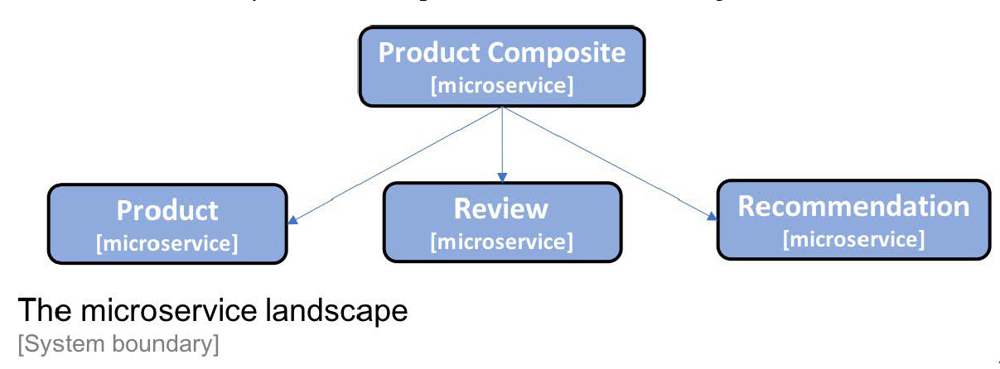
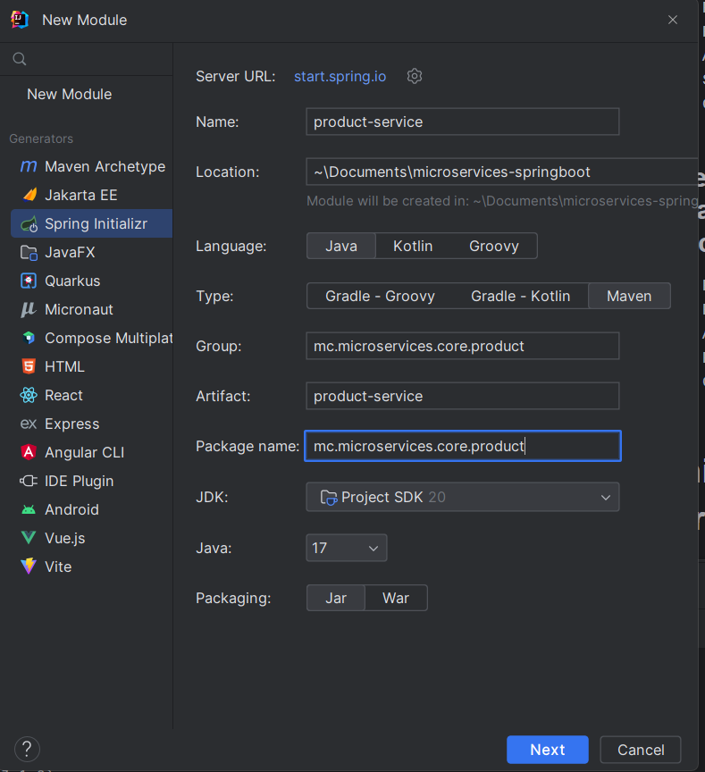
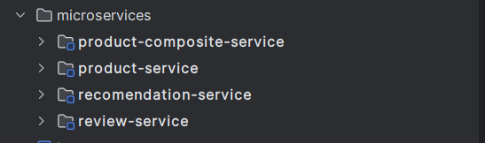

- 3 cores microservices: the Product, Review and Recommendation Service
- 1 composite microservices: the Product Composite service.


## Product service: manages product information
- Product ID
- Name
- Weight

## Review service: manages product reviews
- Product ID
- Review ID
- Author
- Subject
- Content

## Recomendation service: manage product recommendations
- Product ID
- Recommendation ID
- Author
- Rate
- Content

# Init the spring projects
- Init 4 empty spring projects in Intellji.

- Dependency: WebFlux and Actuator
- Result:


# Adding an API and a util project


## Get list of json objects with Spring RestTemplate
```java
String url = "http://example.com/api/objects";
RestTemplate restTemplate = new RestTemplate();
ResponseEntity<List<Object>> response = restTemplate.exchange(
    url,
    HttpMethod.GET,
    null,
    new ParameterizedTypeReference<List<Object>>(){});
List<Object> objects = response.getBody();
```

# Add exception handling

# Deploy microservices using Docker
## Setting max heap size
- By default, max heap size inside a jdk container = 1/4 host memory.
- Add -Xmx option to set the limit

docker pull eclipse-temurin:20-jdk
docker run -it --rm eclipse-temurin:20-jdk java -Xmx600m -XX:+PrintFlagsFinal | grep "size_t MaxHeapSize"

# Building maven multi module
```java
mvn archetype:generate -DgroupId=mc.microservices -DartifactId=microservices-springboot
```
